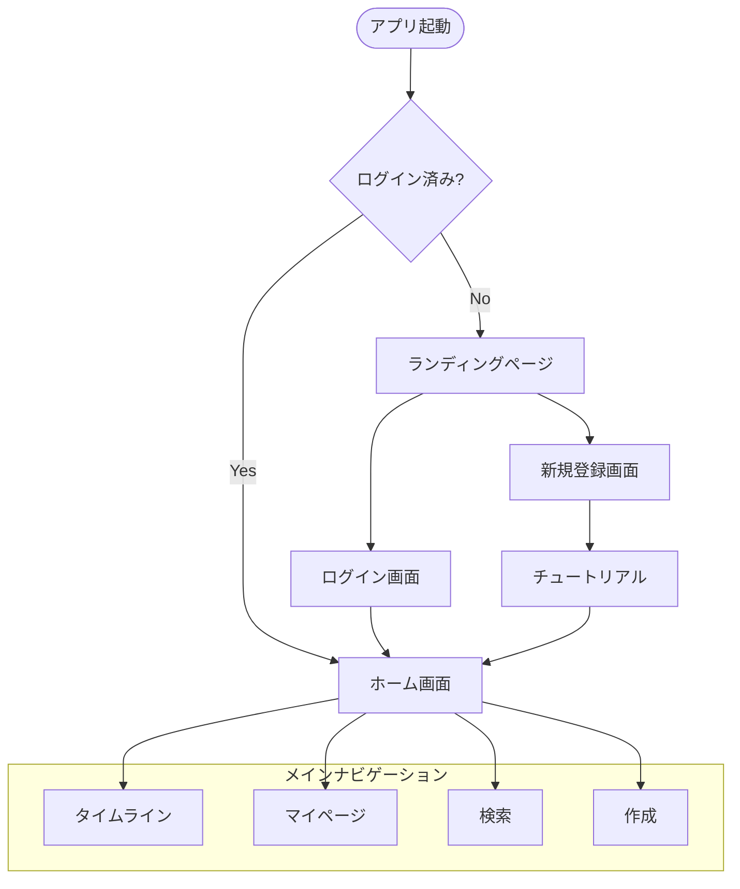
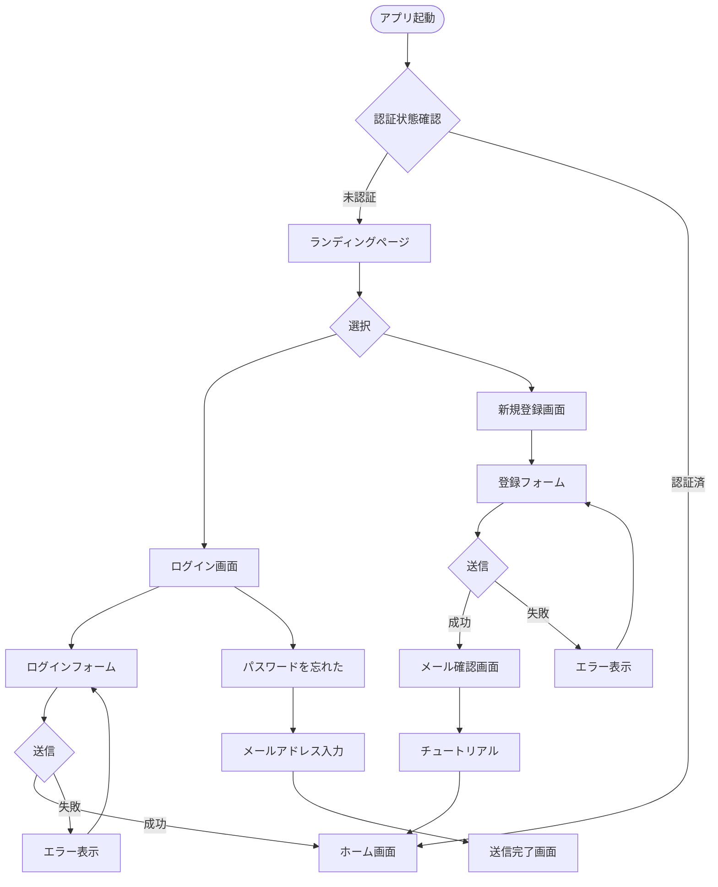
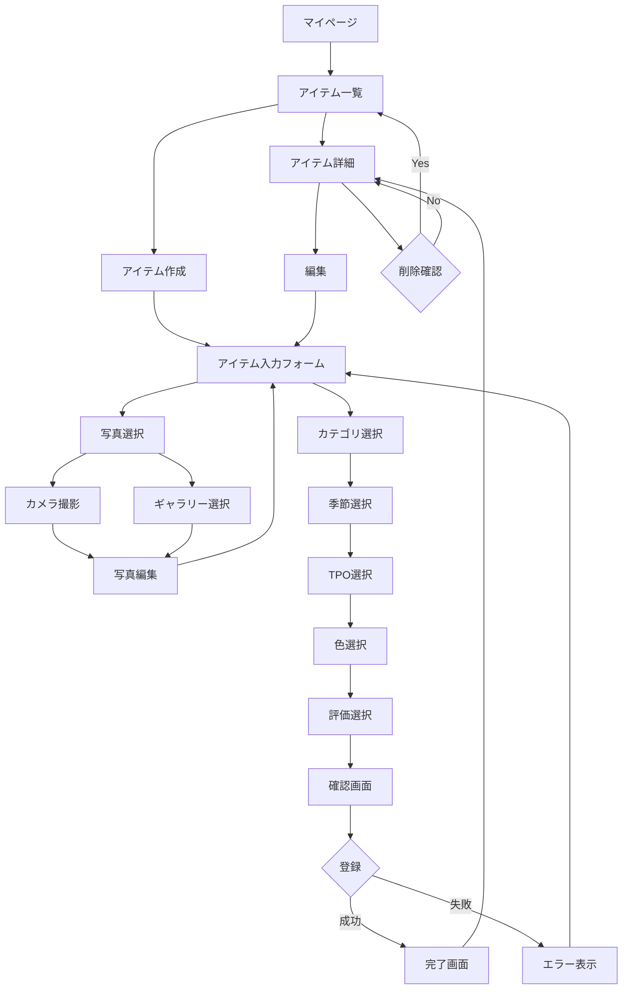
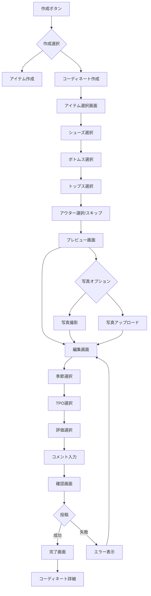
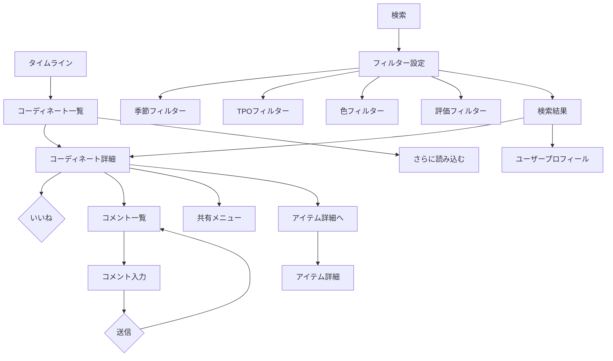
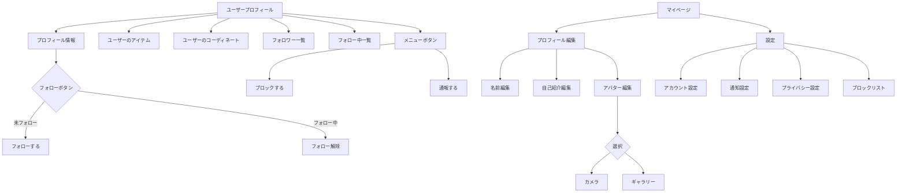
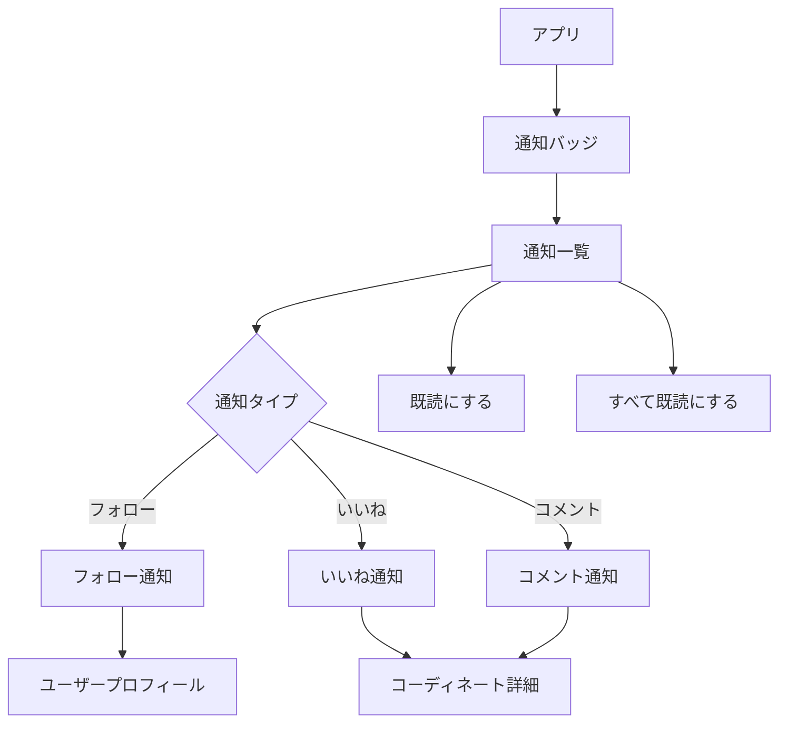
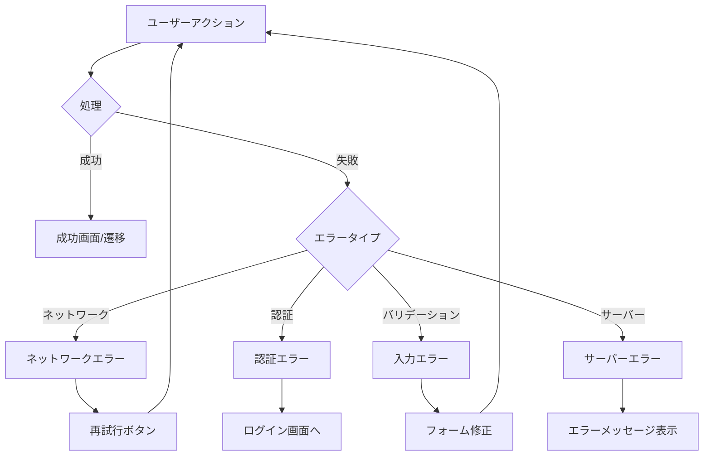

# Speadwear 画面遷移図

## 概要

このドキュメントでは、Speadwearアプリケーションの画面遷移をMermaid記法で図示します。

## 全体の画面構成



## 認証フロー



## アイテム管理フロー



## コーディネート作成フロー



## タイムライン・検索フロー



## ソーシャル機能フロー



## 通知フロー



## エラー・例外処理フロー



## 画面一覧

### 認証関連
1. ランディングページ
2. ログイン画面
3. 新規登録画面
4. パスワードリセット画面
5. チュートリアル画面

### メイン画面
1. ホーム画面（タイムライン）
2. 検索画面
3. 作成選択画面
4. マイページ

### アイテム関連
1. アイテム一覧
2. アイテム詳細
3. アイテム作成/編集
4. カテゴリ選択
5. 写真撮影/選択

### コーディネート関連
1. コーディネート一覧
2. コーディネート詳細
3. コーディネート作成
4. アイテム選択（各カテゴリ）
5. コメント一覧

### ユーザー関連
1. ユーザープロフィール
2. プロフィール編集
3. フォロワー/フォロー中一覧
4. 設定画面
5. ブロックリスト

### その他
1. 通知一覧
2. エラー画面
3. 読み込み中画面
4. 空状態画面

## 主要なユーザーストーリー

### 1. 新規ユーザーの初回利用
```
ランディング → 新規登録 → チュートリアル → アイテム登録 → コーディネート作成 → タイムライン
```

### 2. 日常的な利用
```
ホーム → タイムライン閲覧 → いいね/コメント → フォロー → 通知確認
```

### 3. コーディネート投稿
```
作成ボタン → アイテム選択 → 詳細設定 → 投稿 → シェア
```

### 4. アイテム管理
```
マイページ → アイテム一覧 → アイテム追加 → カテゴリ設定 → 完了
```

### 5. 他ユーザーとの交流
```
検索 → ユーザー発見 → プロフィール閲覧 → フォロー → コメント投稿
```