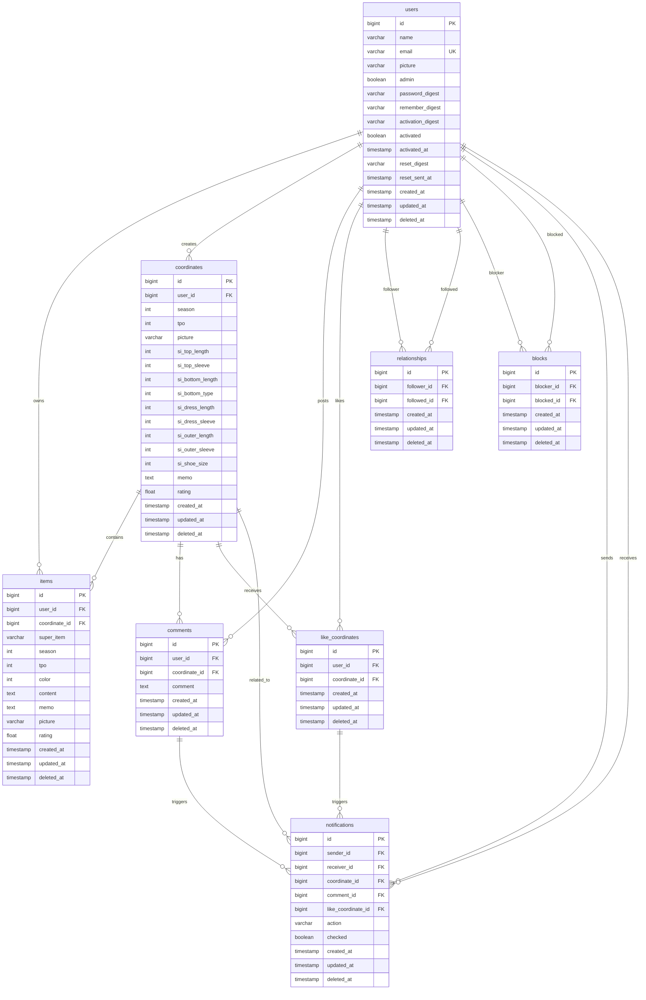
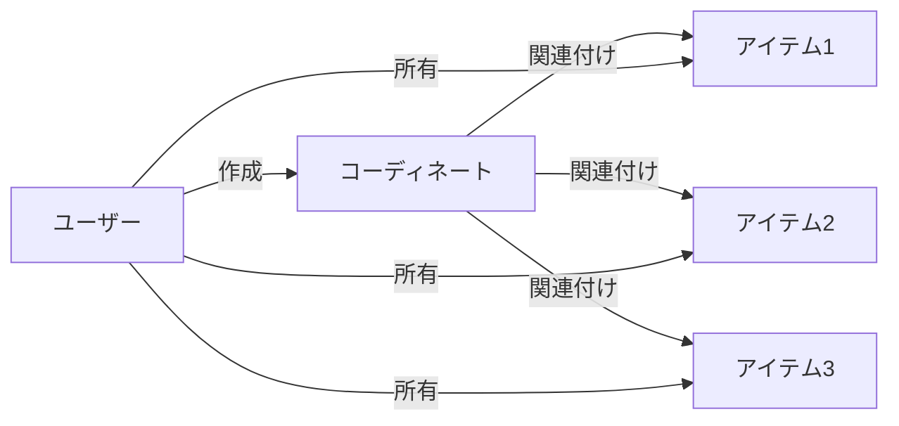
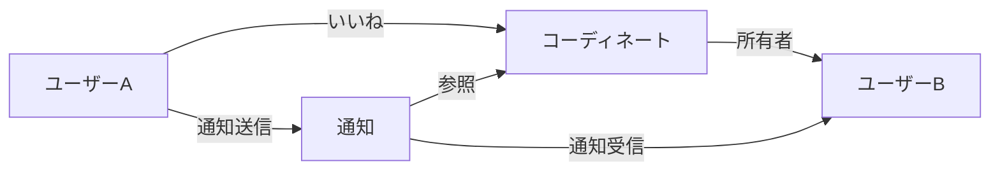
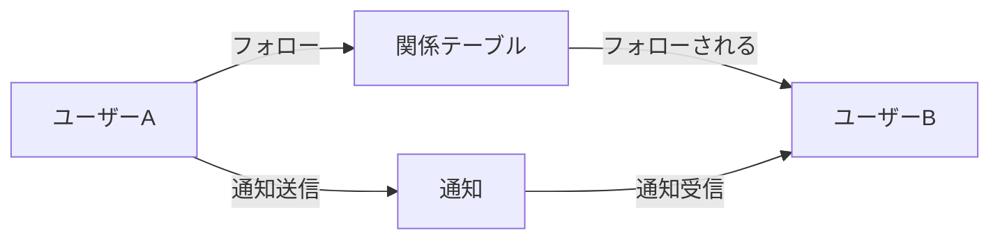

# Speadwear ER図（Entity Relationship Diagram）

## 概要
このドキュメントでは、Speadwearアプリケーションのデータベース構造をER図で表現します。

## ER図（全体）



## 主要なリレーションシップの説明

### 1. ユーザー関連

#### users → items (1:N)
- 1人のユーザーは複数のアイテムを所有できる
- アイテムは必ず1人のユーザーに属する

#### users → coordinates (1:N)
- 1人のユーザーは複数のコーディネートを作成できる
- コーディネートは必ず1人のユーザーに属する

#### users ⇄ users (N:N via relationships)
- フォロー/フォロワー関係
- relationshipsテーブルを介した多対多の関係
- follower_id: フォローする側のユーザー
- followed_id: フォローされる側のユーザー

#### users ⇄ users (N:N via blocks)
- ブロック関係
- blocksテーブルを介した多対多の関係
- blocker_id: ブロックする側のユーザー
- blocked_id: ブロックされる側のユーザー

### 2. コーディネート関連

#### coordinates → items (1:N)
- 1つのコーディネートは複数のアイテムを含む
- アイテムは0または1つのコーディネートに属する（NULLable）

#### coordinates → comments (1:N)
- 1つのコーディネートは複数のコメントを持つ
- コメントは必ず1つのコーディネートに属する

#### coordinates ⇄ users (N:N via like_coordinates)
- いいね関係
- like_coordinatesテーブルを介した多対多の関係

### 3. 通知関連

#### notifications ← users (N:1)
- 通知は送信者と受信者を持つ
- sender_id: 通知を発生させたユーザー
- receiver_id: 通知を受け取るユーザー

#### notifications → 各種エンティティ
- coordinate_id: 関連するコーディネート（いいね、コメント通知）
- comment_id: 関連するコメント（コメント通知）
- like_coordinate_id: 関連するいいね（いいね通知）

## カーディナリティ記法の説明

```
||--o{ : 1対多（1 to many）
||--|| : 1対1（1 to 1）
}o--o{ : 多対多（many to many）
```

- `||` : 1（必須）
- `o{` : 多（0以上）
- `|{` : 多（1以上）

## インデックス設計の可視化

### プライマリキー（PK）
全テーブルで`id`カラムがプライマリキー

### ユニークキー（UK）
- users.email

### 外部キー（FK）とインデックス
- items.user_id → users.id
- items.coordinate_id → coordinates.id
- coordinates.user_id → users.id
- comments.user_id → users.id
- comments.coordinate_id → coordinates.id
- like_coordinates.user_id → users.id
- like_coordinates.coordinate_id → coordinates.id
- relationships.follower_id → users.id
- relationships.followed_id → users.id
- blocks.blocker_id → users.id
- blocks.blocked_id → users.id
- notifications.sender_id → users.id
- notifications.receiver_id → users.id
- notifications.coordinate_id → coordinates.id
- notifications.comment_id → comments.id
- notifications.like_coordinate_id → like_coordinates.id

### 複合ユニークインデックス
- like_coordinates: (user_id, coordinate_id)
- relationships: (follower_id, followed_id)
- blocks: (blocker_id, blocked_id)

## データフロー例

### コーディネート作成フロー


### いいね・通知フロー


### フォロー関係フロー


## 制約とビジネスルール

1. **カスケード削除**
   - ユーザー削除時：関連する全てのデータが削除される
   - コーディネート削除時：関連するコメント、いいねが削除される

2. **NULL設定**
   - アイテムのcoordinate_id：コーディネート削除時にNULLに設定
   - 通知の各種ID：関連エンティティ削除時にNULLに設定

3. **ソフトデリート**
   - 全テーブルでdeleted_atカラムによる論理削除を実装
   - 物理削除は行わない

4. **一意性制約**
   - メールアドレスは全ユーザーで一意
   - 同一ユーザーは同じコーディネートに複数回いいねできない
   - 同一のフォロー関係、ブロック関係は作成できない