# Speadwear システム構成図

## 概要
このドキュメントでは、Speadwearアプリケーションのシステムアーキテクチャを図解します。
クリーンアーキテクチャの原則に基づいた設計を採用しています。

## 1. システム全体構成

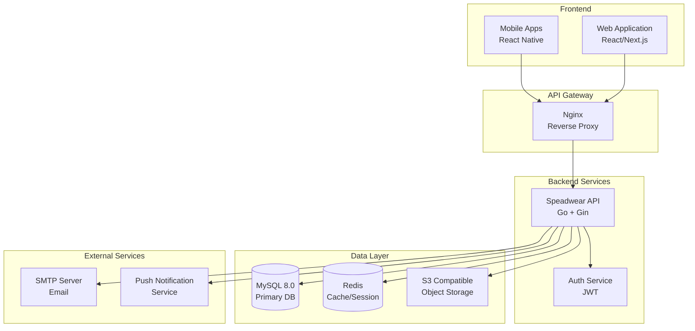

## 2. クリーンアーキテクチャ層構造

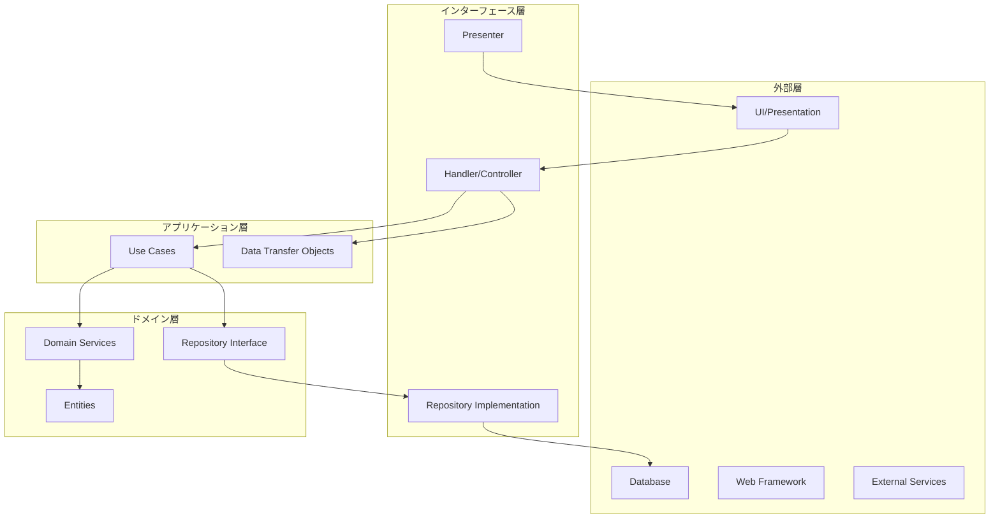

### 各層の責務

#### ドメイン層 (Domain Layer)
- **場所**: `/internal/domain/`
- **責務**: ビジネスロジックとエンティティの定義
- **含まれるもの**:
  - エンティティ（User, Item, Coordinate等）
  - ビジネスルール
  - ドメインサービス
  - リポジトリインターフェース

#### アプリケーション層 (Application Layer)
- **場所**: `/internal/usecase/`
- **責務**: アプリケーション固有のビジネスルール
- **含まれるもの**:
  - ユースケース実装
  - アプリケーションサービス
  - DTOの定義

#### インターフェース層 (Interface Layer)
- **場所**: `/internal/handler/`, `/internal/repository/`
- **責務**: 外部との接続
- **含まれるもの**:
  - HTTPハンドラー
  - リポジトリ実装
  - ミドルウェア

#### インフラストラクチャ層 (Infrastructure Layer)
- **場所**: `/pkg/`
- **責務**: 技術的な実装詳細
- **含まれるもの**:
  - データベース接続
  - 外部サービス連携
  - 設定管理

## 3. 技術スタック詳細

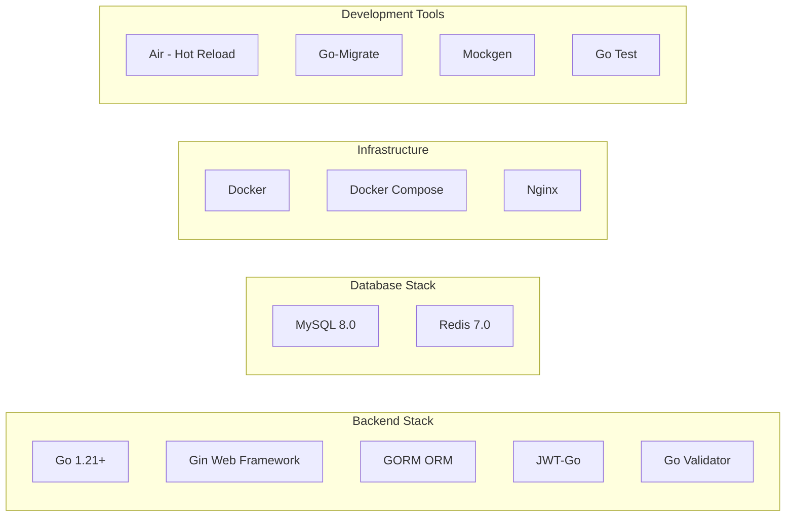

### バックエンド技術選定理由

| 技術 | 選定理由 |
|------|----------|
| Go | 高いパフォーマンス、並行処理、型安全性 |
| Gin | 軽量で高速、豊富なミドルウェア |
| GORM | Go標準のORM、マイグレーション機能 |
| MySQL | 信頼性、ACID準拠、豊富な機能 |
| Redis | 高速キャッシュ、セッション管理 |
| JWT | ステートレス認証、スケーラビリティ |

## 4. デプロイメント構成

### 開発環境

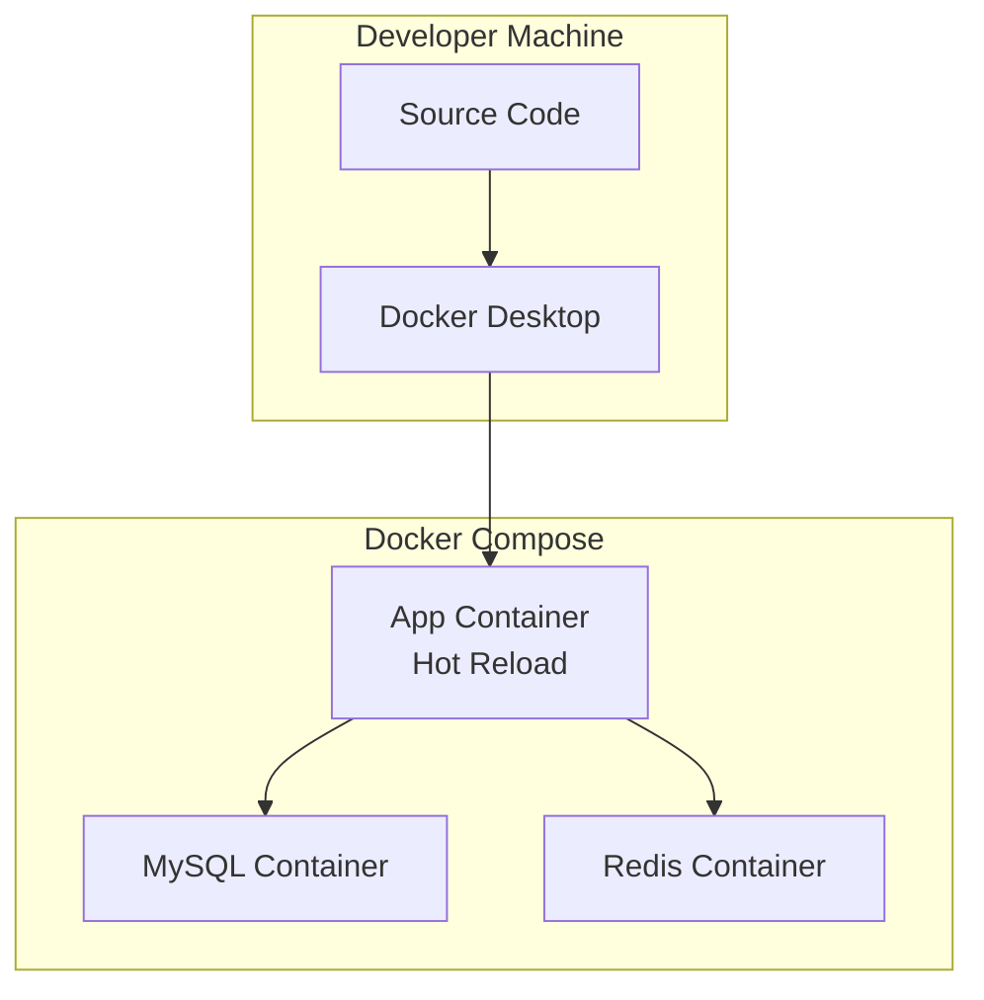

### 本番環境

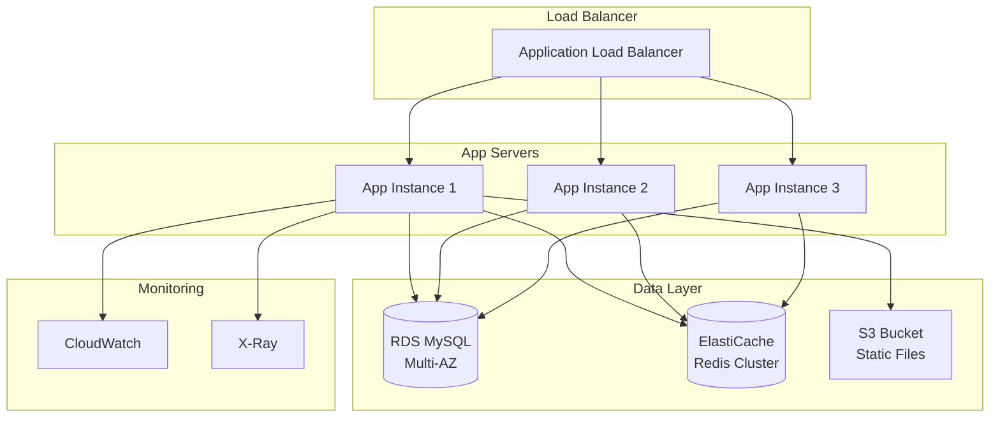

## 5. データフロー図

### 認証フロー

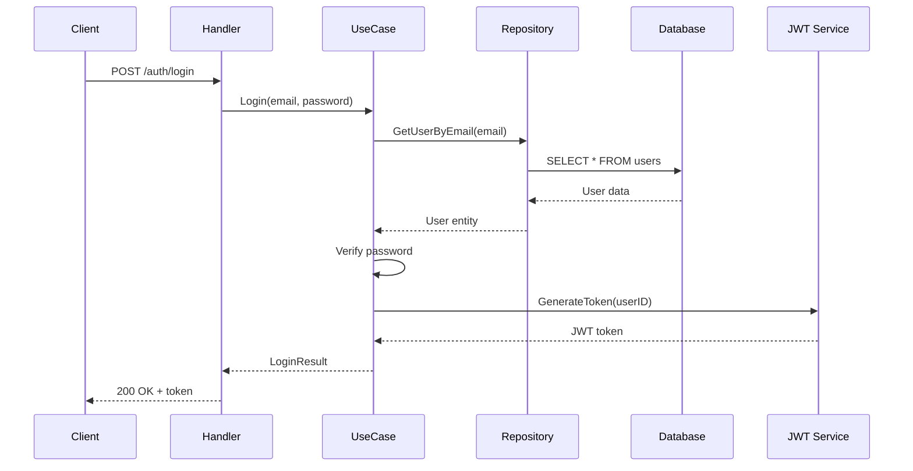

### コーディネート作成フロー

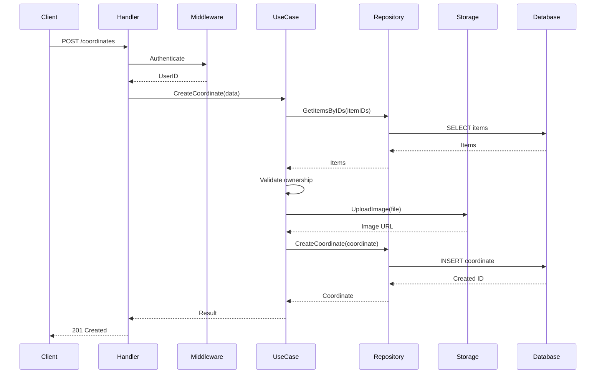

## 6. セキュリティアーキテクチャ

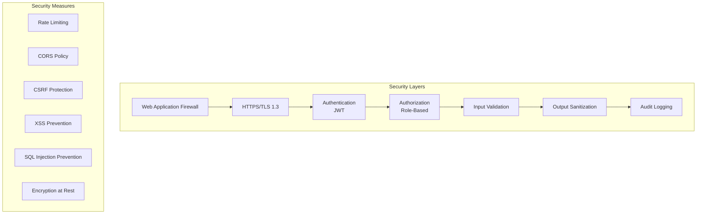

### セキュリティ実装

| 脅威 | 対策 |
|------|------|
| 認証回避 | JWT + リフレッシュトークン |
| SQLインジェクション | パラメータバインディング |
| XSS | 出力エスケープ、CSP |
| CSRF | CSRFトークン |
| DDoS | レート制限、WAF |
| データ漏洩 | 暗号化、アクセス制御 |

## 7. パフォーマンス最適化

### キャッシュ戦略

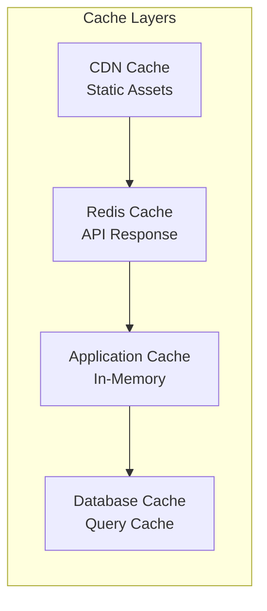

### 最適化技術

| 領域 | 技術 |
|------|------|
| データベース | インデックス最適化、N+1問題対策 |
| API | ページネーション、遅延読み込み |
| キャッシュ | Redis、HTTP キャッシュヘッダー |
| 画像 | 圧縮、WebP、CDN配信 |
| 並行処理 | Goroutineによる非同期処理 |

## 8. 監視・運用

### 監視スタック

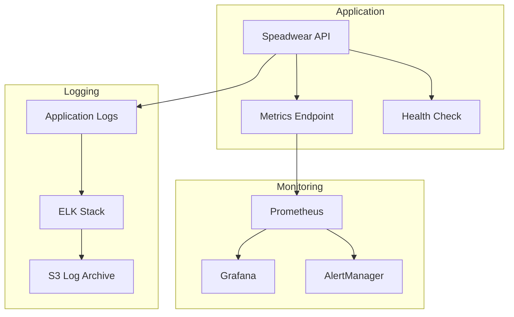

### 監視項目

| カテゴリ | メトリクス |
|----------|------------|
| アプリケーション | レスポンスタイム、エラー率、スループット |
| インフラ | CPU使用率、メモリ使用率、ディスクI/O |
| ビジネス | アクティブユーザー数、投稿数、エンゲージメント率 |

## 9. 災害復旧計画

### バックアップ戦略

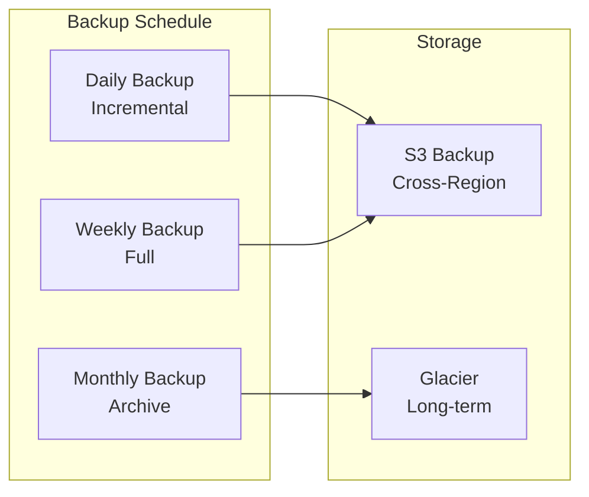

### RTO/RPO目標

| 指標 | 目標値 |
|------|--------|
| RTO (Recovery Time Objective) | 4時間 |
| RPO (Recovery Point Objective) | 1時間 |

## 10. スケーリング戦略

### 水平スケーリング

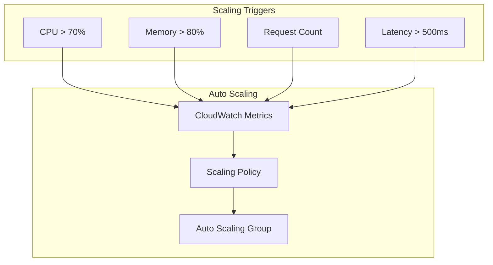

### スケーリング計画

| フェーズ | ユーザー数 | インフラ構成 |
|----------|-----------|--------------|
| 初期 | 〜10,000 | 2 instances + RDS |
| 成長期 | 〜100,000 | 4 instances + RDS Read Replica |
| 拡大期 | 〜1,000,000 | Auto Scaling + Aurora |

## まとめ

Speadwearのシステムアーキテクチャは、以下の原則に基づいて設計されています：

1. **クリーンアーキテクチャ**: ビジネスロジックの独立性
2. **マイクロサービス指向**: 将来的な分割を考慮
3. **スケーラビリティ**: 水平スケーリング対応
4. **高可用性**: 冗長性とフェイルオーバー
5. **セキュリティ**: 多層防御
6. **監視可能性**: 包括的なメトリクス収集